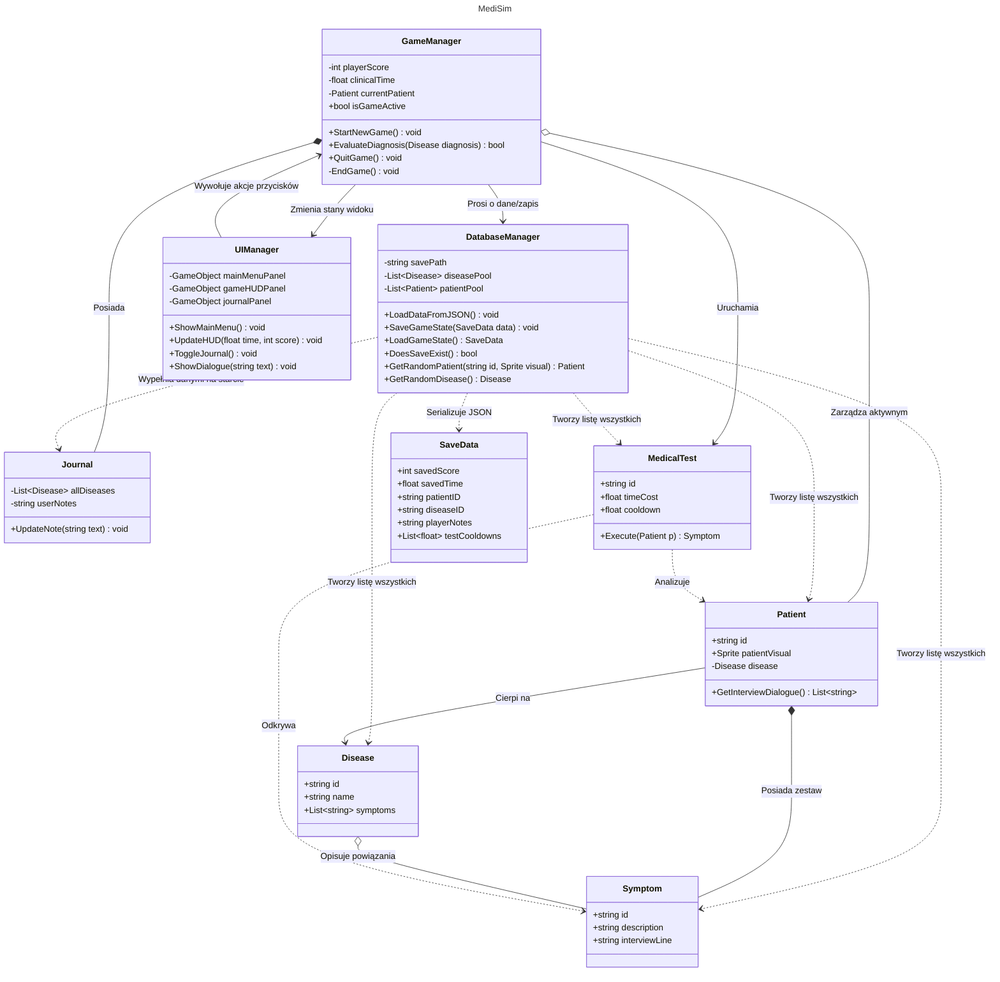

```mermaid
---
title: MediSim
---
classDiagram
    %% Główne menedżery
    class GameManager {
        -int playerScore
        -float clinicalTime
        -Patient currentPatient
        +bool isGameActive
        +StartNewGame() void
        +EvaluateDiagnosis(Disease diagnosis) bool
        +QuitGame() void
        -EndGame() void
    }
    class DatabaseManager {
        -string savePath
        -List~Disease~ diseasePool
        -List~Patient~ patientPool
        +LoadDataFromJSON() void
        +SaveGameState(SaveData data) void
        +LoadGameState() SaveData
        +DoesSaveExist() bool
        +GetRandomPatient(string id, Sprite visual) Patient
        +GetRandomDisease() Disease
    }
    class UIManager {
        -GameObject mainMenuPanel
        -GameObject gameHUDPanel
        -GameObject journalPanel
        +ShowMainMenu() void
        +UpdateHUD(float time, int score) void
        +ToggleJournal() void
        +ShowDialogue(string text) void
    }
    %% Modele danych
    class Patient {
        +string id
        +Sprite patientVisual
        -Disease disease
        +GetInterviewDialogue() List~string~
    }
    class Disease {
        +string id
        +string name
        +List~string~ symptoms
    }
    class Symptom {
        +string id
        +string description
        +string interviewLine
    }
    %% Rozgrywka i przechowywanie danych
    class Journal {
        -List~Disease~ allDiseases
        -string userNotes
        +UpdateNote(string text) void
    }
    class MedicalTest {
        +string id
        +float timeCost
        +float cooldown
        +Execute(Patient p) Symptom
    }
    class SaveData {
        +int savedScore
        +float savedTime
        +string patientID
        +string diseaseID
        +string playerNotes
        +List~float~ testCooldowns
    }
    %% Relacje
    GameManager --> DatabaseManager : Prosi o dane/zapis
    GameManager --> UIManager : Zmienia stany widoku
    UIManager --> GameManager : Wywołuje akcje przycisków
    GameManager o-- Patient : Zarządza aktywnym
    GameManager --> MedicalTest : Uruchamia
    GameManager *-- Journal : Posiada
    DatabaseManager ..> SaveData : Serializuje JSON
    DatabaseManager ..> Journal : Wypełnia danymi na starcie
    DatabaseManager ..> Disease : Tworzy listę wszystkich
    DatabaseManager ..> Patient : Tworzy listę wszystkich
    DatabaseManager ..> Symptom : Tworzy listę wszystkich
    DatabaseManager ..> MedicalTest : Tworzy listę wszystkich
    Patient --> Disease : Cierpi na
    Patient *-- Symptom : Posiada zestaw
    Disease o-- Symptom : Opisuje powiązania
    MedicalTest ..> Patient : Analizuje
    MedicalTest ..> Symptom : Odkrywa
```
