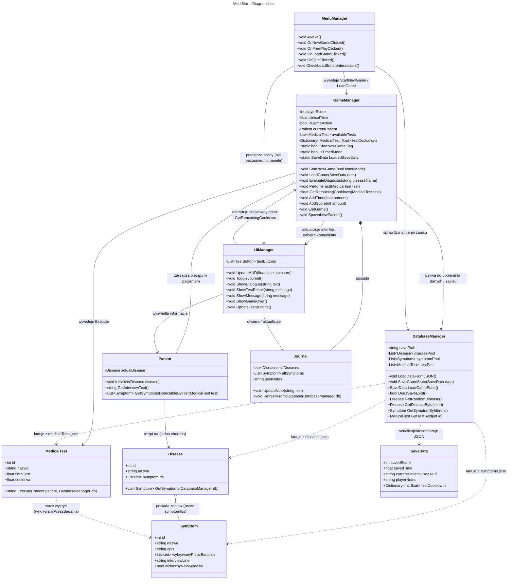

```mermaid
---
title: MediSim – Diagram klas
---
classDiagram
    %% Główny manager rozgrywki
    class GameManager {
        -int playerScore
        -float clinicalTime
        -bool isGameActive
        -Patient currentPatient
        -List~MedicalTest~ availableTests
        -Dictionary~MedicalTest, float~ testCooldowns
        +static bool StartNewGameFlag
        +static bool IsTimedMode
        +static SaveData LoadedSaveData
        +void StartNewGame(bool timedMode)
        +void LoadGame(SaveData data)
        +void EvaluateDiagnosis(string diseaseName)
        +void PerformTest(MedicalTest test)
        +float GetRemainingCooldown(MedicalTest test)
        +void AddTime(float amount)
        +void AddScore(int amount)
        -void EndGame()
        -void SpawnNewPatient()
    }

    class DatabaseManager {
        -string savePath
        -List~Disease~ diseasePool
        -List~Symptom~ symptomPool
        -List~MedicalTest~ testPool
        +void LoadDataFromJSON()
        +void SaveGameState(SaveData data)
        +SaveData LoadGameState()
        +bool DoesSaveExist()
        +Disease GetRandomDisease()
        +Disease GetDiseaseById(int id)
        +Symptom GetSymptomById(int id)
        +MedicalTest GetTestById(int id)
    }

    class UIManager {
        -List~TestButton~ testButtons
        +void UpdateHUD(float time, int score)
        +void ToggleJournal()
        +void ShowDialogue(string text)
        +void ShowTestResult(string message)
        +void ShowMessage(string message)
        +void ShowGameOver()
        +void UpdateTestButtons()
    }

    class MenuManager {
        +void Awake()
        +void OnNewGameClicked()
        +void OnFreePlayClicked()
        +void OnLoadGameClicked()
        +void OnQuitClicked()
        -void CheckLoadButtonInteractable()
    }

    %% Modele danych
    class Patient {
        -Disease actualDisease
        +void Initialize(Disease disease)
        +string GetInterviewText()
        +List~Symptom~ GetSymptomsDetectableByTest(MedicalTest test)
    }

    class Disease {
        +int id
        +string nazwa
        +List~int~ symptomIds
        +List~Symptom~ GetSymptoms(DatabaseManager db)
    }

    class Symptom {
        +int id
        +string nazwa
        +string opis
        +List~int~ wykrywanyPrzezBadania
        +string interviewLine
        +bool widocznyNaWygladzie
    }

    class MedicalTest {
        +int id
        +string nazwa
        +float timeCost
        +float cooldown
        +string Execute(Patient patient, DatabaseManager db)
    }

    class Journal {
        -List~Disease~ allDiseases
        -List~Symptom~ allSymptoms
        -string userNotes
        +void UpdateNote(string text)
        +void RefreshFromDatabase(DatabaseManager db)
    }

    class SaveData {
        +int savedScore
        +float savedTime
        +string currentPatientDiseaseId
        +string playerNotes
        +Dictionary~int, float~ testCooldowns
    }

    %% Relacje
    GameManager --> DatabaseManager : używa do pobierania danych / zapisu
    GameManager --> UIManager : aktualizuje interfejs, odbiera komunikaty
    GameManager o-- Patient : zarządza bieżącym pacjentem
    GameManager --> MedicalTest : wywołuje Execute
    GameManager *-- Journal : posiada

    DatabaseManager ..> SaveData : serializuje/deserializuje JSON
    DatabaseManager ..> Disease : ładuje z diseases.json
    DatabaseManager ..> Symptom : ładuje z symptoms.json
    DatabaseManager ..> MedicalTest : ładuje z medicalTests.json

    Patient --> Disease : cierpi na (jedna choroba)
    Disease o-- Symptom : posiada zestaw (przez symptomIds)
    MedicalTest ..> Symptom : może wykryć (wykrywanyPrzezBadania)

    UIManager --> GameManager : odczytuje cooldowny przez GetRemainingCooldown
    UIManager --> Patient : wyświetla informacje
    UIManager --> Journal : otwiera / aktualizuje

    MenuManager --> GameManager : wywołuje StartNewGame / LoadGame
    MenuManager --> DatabaseManager : sprawdza istnienie zapisu
    MenuManager --> UIManager : przełącza sceny (nie bezpośrednio panele)
```
