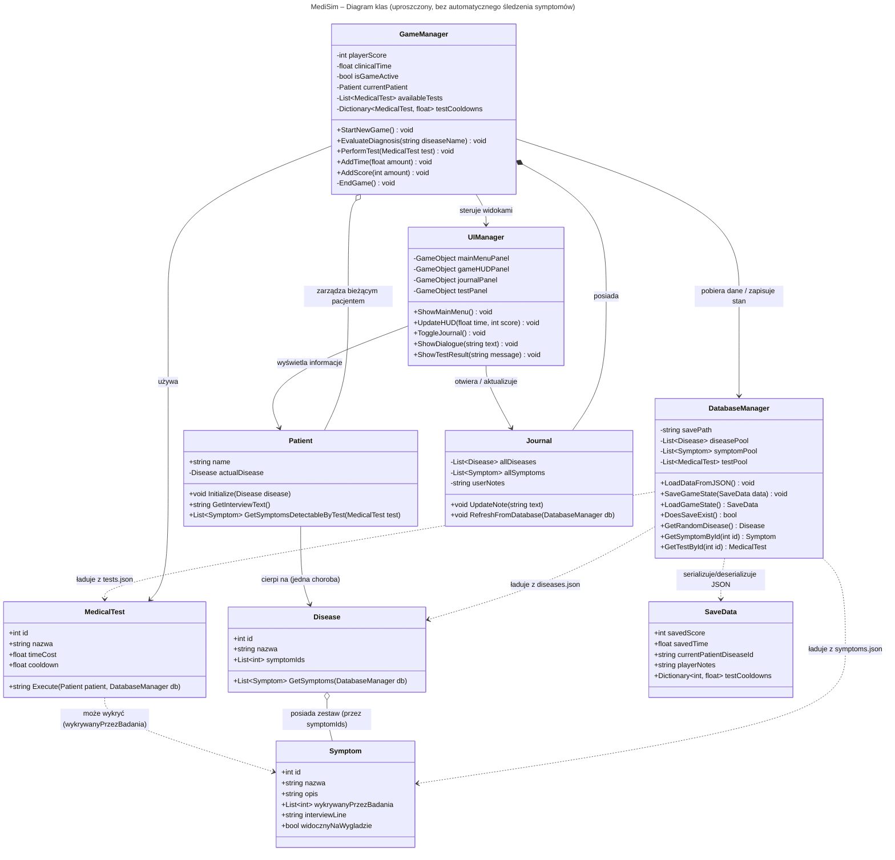

```mermaid
---
title: MediSim – Diagram klas (uproszczony, bez automatycznego śledzenia symptomów)
---
classDiagram
    %% Główni menedżerowie
    class GameManager {
        -int playerScore
        -float clinicalTime
        -bool isGameActive
        -Patient currentPatient
        -List~MedicalTest~ availableTests
        -Dictionary~MedicalTest, float~ testCooldowns
        +StartNewGame() void
        +EvaluateDiagnosis(string diseaseName) void
        +PerformTest(MedicalTest test) void
        +AddTime(float amount) void
        +AddScore(int amount) void
        -EndGame() void
    }

    class DatabaseManager {
        -string savePath
        -List~Disease~ diseasePool
        -List~Symptom~ symptomPool
        -List~MedicalTest~ testPool
        +LoadDataFromJSON() void
        +SaveGameState(SaveData data) void
        +LoadGameState() SaveData
        +DoesSaveExist() bool
        +GetRandomDisease() Disease
        +GetSymptomById(int id) Symptom
        +GetTestById(int id) MedicalTest
    }

    class UIManager {
        -GameObject mainMenuPanel
        -GameObject gameHUDPanel
        -GameObject journalPanel
        -GameObject testPanel
        +ShowMainMenu() void
        +UpdateHUD(float time, int score) void
        +ToggleJournal() void
        +ShowDialogue(string text) void
        +ShowTestResult(string message) void
    }

    %% Modele danych
    class Patient {
        +string name
        -Disease actualDisease
        +void Initialize(Disease disease)
        +string GetInterviewText()
        +List~Symptom~ GetSymptomsDetectableByTest(MedicalTest test)
    }

    class Disease {
        +int id
        +string nazwa
        +List~int~ symptomIds
        +List~Symptom~ GetSymptoms(DatabaseManager db)
    }

    class Symptom {
        +int id
        +string nazwa
        +string opis
        +List~int~ wykrywanyPrzezBadania
        +string interviewLine
        +bool widocznyNaWygladzie
    }

    class MedicalTest {
        +int id
        +string nazwa
        +float timeCost
        +float cooldown
        +string Execute(Patient patient, DatabaseManager db)
    }

    class Journal {
        -List~Disease~ allDiseases
        -List~Symptom~ allSymptoms
        -string userNotes
        +void UpdateNote(string text)
        +void RefreshFromDatabase(DatabaseManager db)
    }

    class SaveData {
        +int savedScore
        +float savedTime
        +string currentPatientDiseaseId
        +string playerNotes
        +Dictionary~int, float~ testCooldowns
    }

    %% Relacje
    GameManager --> DatabaseManager : pobiera dane / zapisuje stan
    GameManager --> UIManager : steruje widokami
    GameManager o-- Patient : zarządza bieżącym pacjentem
    GameManager --> MedicalTest : używa
    GameManager *-- Journal : posiada

    DatabaseManager ..> SaveData : serializuje/deserializuje JSON
    DatabaseManager ..> Disease : ładuje z diseases.json
    DatabaseManager ..> Symptom : ładuje z symptoms.json
    DatabaseManager ..> MedicalTest : ładuje z tests.json

    Patient --> Disease : cierpi na (jedna choroba)
    Disease o-- Symptom : posiada zestaw (przez symptomIds)
    MedicalTest ..> Symptom : może wykryć (wykrywanyPrzezBadania)

    UIManager --> Patient : wyświetla informacje
    UIManager --> Journal : otwiera / aktualizuje
```
