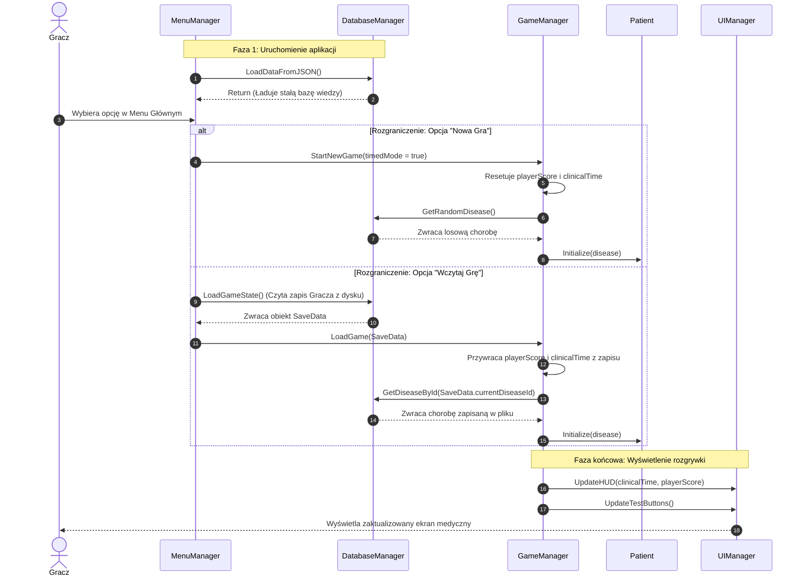
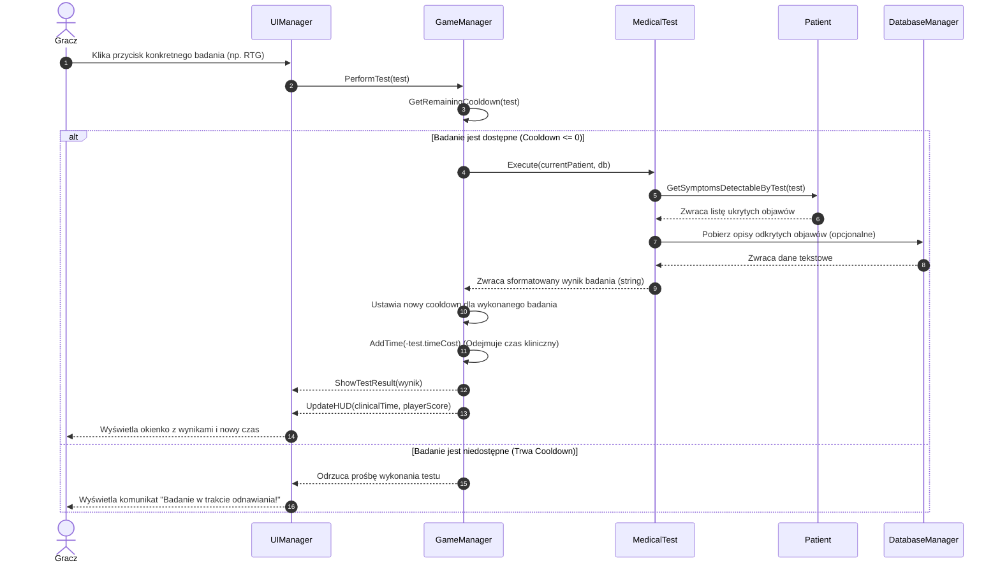

### Sekwencja 1: Inicjalizowanie gry

```mermaid
sequenceDiagram
    autonumber
    actor Gracz
    participant Menu as MenuManager
    participant DB as DatabaseManager
    participant GM as GameManager
    participant Pacjent as Patient
    participant UI as UIManager

    %% Faza 1: Zawsze taka sama
    Note over Menu, DB: Faza 1: Uruchomienie aplikacji
    Menu->>DB: LoadDataFromJSON()
    DB-->>Menu: Return (Ładuje stałą bazę wiedzy)

    %% Decyzja Gracza
    Gracz->>Menu: Wybiera opcję w Menu Głównym

    alt Rozgraniczenie: Opcja "Nowa Gra"
        Menu->>GM: StartNewGame(timedMode = true)
        GM->>GM: Resetuje playerScore i clinicalTime
        
        %% Losowanie od zera
        GM->>DB: GetRandomDisease()
        DB-->>GM: Zwraca losową chorobę
        GM->>Pacjent: Initialize(disease)
        
    else Rozgraniczenie: Opcja "Wczytaj Grę"
        Menu->>DB: LoadGameState() (Czyta zapis Gracza z dysku)
        DB-->>Menu: Zwraca obiekt SaveData
        Menu->>GM: LoadGame(SaveData)
        
        %% Odtwarzanie ze stanu zapisu
        GM->>GM: Przywraca playerScore i clinicalTime z zapisu
        GM->>DB: GetDiseaseById(SaveData.currentDiseaseId)
        DB-->>GM: Zwraca chorobę zapisaną w pliku
        GM->>Pacjent: Initialize(disease)
    end

    %% Faza końcowa: Zawsze taka sama, niezależnie od wyboru
    Note over GM, UI: Faza końcowa: Wyświetlenie rozgrywki
    GM->>UI: UpdateHUD(clinicalTime, playerScore)
    GM->>UI: UpdateTestButtons()
    UI-->>Gracz: Wyświetla zaktualizowany ekran medyczny
```

---

### Sekwencja 2: Przeprowadzanie testu medycznego

```mermaid    
sequenceDiagram
    autonumber
    actor Gracz
    participant UI as UIManager
    participant GM as GameManager
    participant Test as MedicalTest
    participant Pacjent as Patient
    participant DB as DatabaseManager

    Gracz->>UI: Klika przycisk konkretnego badania (np. RTG)
    UI->>GM: PerformTest(test)
    
    %% Sprawdzenie, czy badanie nie jest zablokowane czasem
    GM->>GM: GetRemainingCooldown(test)
    
    alt Badanie jest dostępne (Cooldown <= 0)
        %% Właściwe wykonanie testu
        GM->>Test: Execute(currentPatient, db)
        
        Test->>Pacjent: GetSymptomsDetectableByTest(test)
        Pacjent-->>Test: Zwraca listę ukrytych objawów
        
        %% Opcjonalne dociągnięcie opisów z bazy danych
        Test->>DB: Pobierz opisy odkrytych objawów (opcjonalne)
        DB-->>Test: Zwraca dane tekstowe
        
        Test-->>GM: Zwraca sformatowany wynik badania (string)
        
        %% Kary czasowe i aktualizacja stanu
        GM->>GM: Ustawia nowy cooldown dla wykonanego badania
        GM->>GM: AddTime(-test.timeCost) (Odejmuje czas kliniczny)
        
        %% Aktualizacja interfejsu
        GM-->>UI: ShowTestResult(wynik)
        GM-->>UI: UpdateHUD(clinicalTime, playerScore)
        UI-->>Gracz: Wyświetla okienko z wynikami i nowy czas
        
    else Badanie jest niedostępne (Trwa Cooldown)
        GM-->>UI: Odrzuca prośbę wykonania testu
        UI-->>Gracz: Wyświetla komunikat "Badanie w trakcie odnawiania!"
    end
```
